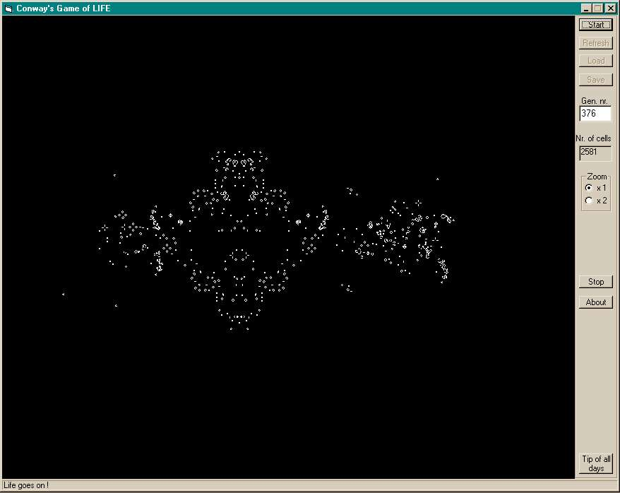



## A Conway's Game of LIFE

### Description

Cellular automata are programs which simulate artificial life and "Conway's Game of LIFE" is the most popular cellular automatum ever. My version of LIFE is not the fastest in the world but is much faster than many programs I have seen, even written in C++ or/and assembly language (mine is in pure Visual Basic). The "game" is "played" on a grid of 2616 x 2016 cells and it runs smoothly even with 5000 cells or more. I also icluded 85 hit patterns created in the 70's, 80's and 90's.
 
### More Info
 

             |
---                |---
**Submitted On**   |2001-06-20 13:50:52
**By**             |[Bog Crist](https://github.com/Planet-Source-Code/PSCIndex/blob/master/ByAuthor/bog-crist.md)
**Level**          |Intermediate
**User Rating**    |4.5 (27 globes from 6 users)
**Compatibility**  |VB 6\.0
**Category**       |[Games](https://github.com/Planet-Source-Code/PSCIndex/blob/master/ByCategory/games__1-38.md)
**World**          |[Visual Basic](https://github.com/Planet-Source-Code/PSCIndex/blob/master/ByWorld/visual-basic.md)
**Archive File**   |[A Conway's214326202001\.zip](https://github.com/Planet-Source-Code/bog-crist-a-conway-s-game-of-life__1-23762/archive/master.zip)

